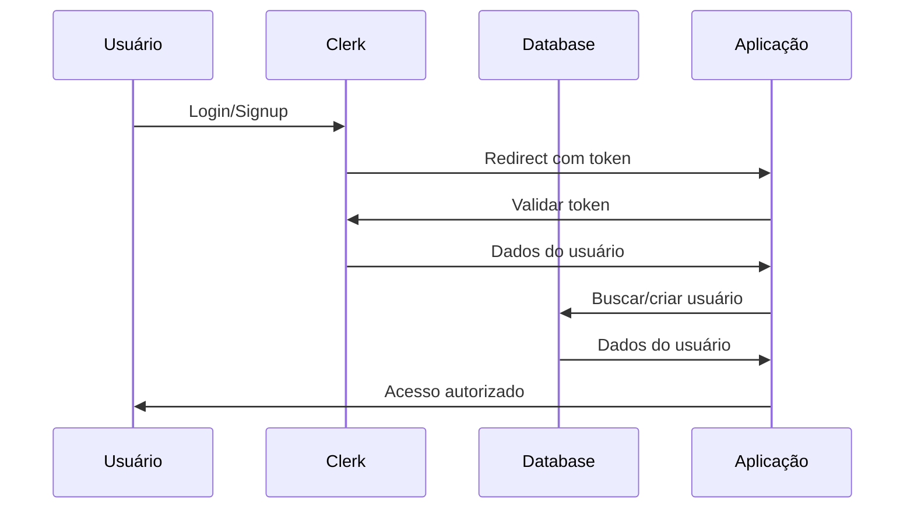
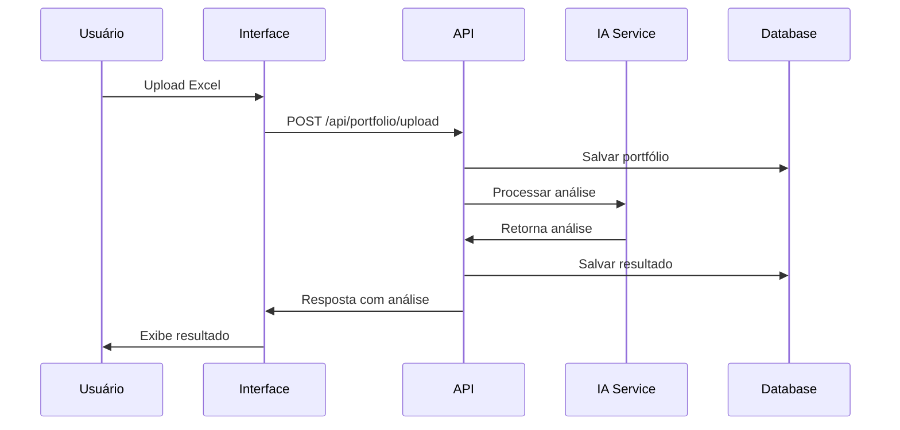
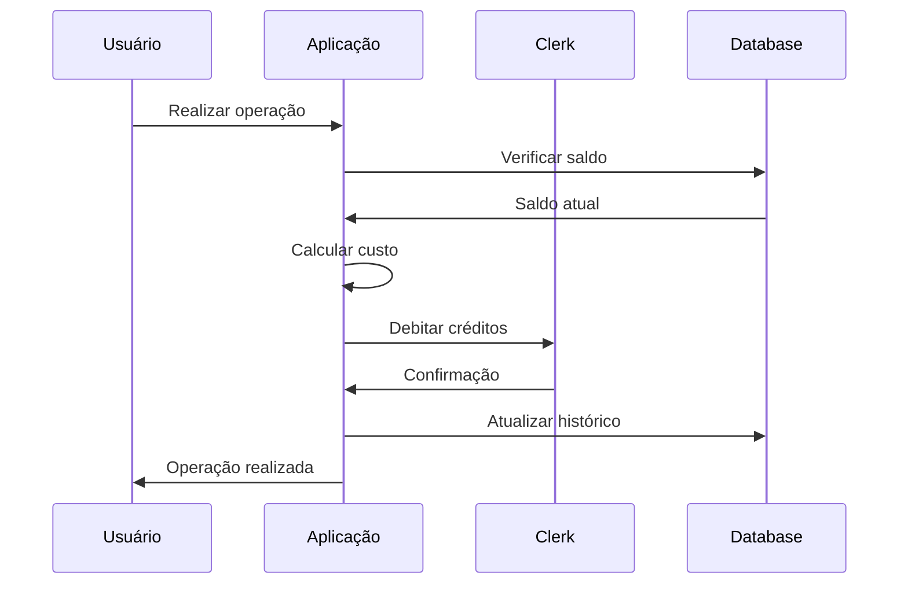

# 🏗️ Arquitetura do Sistema FiiAI

## 📋 Visão Geral

O FiiAI é uma aplicação SaaS construída com arquitetura moderna baseada em Next.js 15 com App Router, seguindo padrões de desenvolvimento escaláveis e maintíveis.

## 🎯 Arquitetura de Alto Nível

```
┌─────────────────┐    ┌─────────────────┐    ┌─────────────────┐
│   Frontend      │    │   Backend       │    │   Database      │
│   (Next.js)     │◄──►│   (API Routes)  │◄──►│   (PostgreSQL)  │
│                 │    │                 │    │                 │
│ • React 19      │    │ • Node.js       │    │ • Prisma ORM    │
│ • TypeScript    │    │ • TypeScript    │    │ • Migrations    │
│ • Tailwind CSS  │    │ • Zod Validation│    │ • Indexing      │
│ • Radix UI      │    │ • TanStack Query│    │                 │
└─────────────────┘    └─────────────────┘    └─────────────────┘
         │                        │                        │
         └────────────────────────┼────────────────────────┘
                                  │
                    ┌─────────────────┐
                    │   External APIs │
                    │                 │
                    │ • Clerk Auth    │
                    │ • AI Services   │
                    │ • File Storage  │
                    └─────────────────┘
```

## 🔧 Stack Tecnológico

### **Frontend**
- **Framework:** Next.js 15.3.5 com App Router
- **Linguagem:** TypeScript (modo não-strict)
- **UI Library:** React 19
- **Styling:** Tailwind CSS v4 + Radix UI
- **Estado:** TanStack Query + React hooks
- **Formulários:** React Hook Form + Zod
- **Animações:** Framer Motion

### **Backend**
- **Runtime:** Node.js
- **Framework:** Next.js API Routes
- **ORM:** Prisma
- **Banco de Dados:** PostgreSQL
- **Validação:** Zod schemas
- **Autenticação:** Clerk

### **Infraestrutura**
- **Deploy:** Vercel
- **Banco:** PostgreSQL (Vercel/Neon)
- **Storage:** Vercel Blob
- **Monitoramento:** Vercel Analytics

## 📁 Estrutura de Diretórios

```
src/
├── app/                          # Next.js App Router
│   ├── (public)/                # Rotas públicas
│   │   ├── sign-in/             # Página de login
│   │   ├── sign-up/             # Página de cadastro
│   │   └── page.tsx             # Landing page
│   ├── (protected)/             # Rotas protegidas
│   │   ├── dashboard/           # Dashboard principal
│   │   ├── billing/             # Gestão de assinatura
│   │   └── layout.tsx           # Layout com sidebar
│   ├── admin/                   # Painel administrativo
│   │   ├── settings/            # Configurações
│   │   ├── users/               # Gestão de usuários
│   │   ├── credits/             # Gestão de créditos
│   │   └── usage/               # Analytics de uso
│   └── api/                     # API Routes
│       ├── credits/             # Endpoints de créditos
│       └── admin/               # Endpoints admin
├── components/                   # Componentes React
│   ├── ui/                      # Componentes base (Radix)
│   ├── app/                     # Componentes da aplicação
│   └── providers/               # Context providers
├── lib/                         # Utilitários e configurações
│   ├── db.ts                    # Cliente Prisma
│   ├── auth-utils.ts            # Helpers de autenticação
│   ├── api-client.ts            # Cliente HTTP
│   └── utils.ts                 # Funções utilitárias
├── hooks/                       # Custom React hooks
│   ├── admin/                   # Hooks específicos do admin
│   └── use-*.ts                 # Hooks gerais
└── types/                       # Definições TypeScript
```

## 🔄 Fluxos Principais

### **1. Fluxo de Autenticação**



### **2. Fluxo de Análise de Portfólio**



### **3. Fluxo de Gestão de Créditos**



## 🛡️ Segurança e Autenticação

### **Middleware de Proteção**
```typescript
// middleware.ts
export default clerkMiddleware((auth, req) => {
  // Proteção de rotas administrativas
  if (req.nextUrl.pathname.startsWith('/admin')) {
    auth().protect({ role: 'admin' });
  }

  // Proteção de rotas privadas
  if (req.nextUrl.pathname.startsWith('/(protected)')) {
    auth().protect();
  }
});
```

### **Verificação Server-Side**
```typescript
// API Routes
export async function GET() {
  const { userId } = await auth();
  if (!userId) {
    return new Response('Unauthorized', { status: 401 });
  }

  const user = await getUserFromClerkId(userId);
  // ... lógica do endpoint
}
```

### **Verificação Client-Side**
```typescript
// Componentes protegidos
export function ProtectedComponent() {
  const { isSignedIn, user } = useAuth();

  if (!isSignedIn) {
    return <RedirectToSignIn />;
  }

  return <ComponentContent />;
}
```

## 📊 Gerenciamento de Estado

### **TanStack Query Pattern**
```typescript
// Custom hooks para queries
export function useUserPortfolios() {
  return useQuery<UserPortfolio[]>({
    queryKey: ['portfolios'],
    queryFn: () => api.get('/api/portfolios'),
    staleTime: 5 * 60_000, // 5 minutos
  });
}

// Custom hooks para mutations
export function useCreatePortfolio() {
  const queryClient = useQueryClient();

  return useMutation({
    mutationFn: (data: CreatePortfolioData) =>
      api.post('/api/portfolios', data),
    onSuccess: () => {
      queryClient.invalidateQueries({ queryKey: ['portfolios'] });
    },
  });
}
```

### **Estratégia de Cache**
- **Queries:** Cache inteligente com invalidação automática
- **Mutations:** Invalidação de queries relacionadas
- **Background Refetch:** Dados sempre atualizados
- **Optimistic Updates:** Feedback imediato ao usuário

## 🗄️ Arquitetura do Banco de Dados

### **Modelos Principais**
```prisma
// Core entities
model User {
  id        String @id @default(cuid())
  clerkId   String @unique
  email     String? @unique
  // ... outros campos
}

model CreditBalance {
  id               String @id @default(cuid())
  userId           String @unique
  creditsRemaining Int @default(100)
  // ... outros campos
}

// FII Domain entities
model UserPortfolio {
  id               String @id @default(cuid())
  userId           String
  positions        Json // Array de posições
  totalValue       Float
  // ... outros campos
}

model AnalysisReport {
  id                  String @id @default(cuid())
  userId              String
  userPortfolioId     String?
  analysisType        AnalysisType
  summary             String @db.Text
  currentAllocation   Json
  riskAssessment      Json
  performanceMetrics  Json
  recommendations     Json
  // ... outros campos
}
```

### **Relacionamentos**
- **User** ←→ **CreditBalance** (1:1)
- **User** ←→ **UserPortfolio** (1:N)
- **UserPortfolio** ←→ **AnalysisReport** (1:N)
- **AnalysisReport** ←→ **InvestmentRecommendation** (1:N)

## 🔌 Integrações Externas

### **Clerk Authentication**
- **SSO:** Suporte a múltiplos provedores
- **Webhooks:** Sincronização de dados
- **Metadata:** Armazenamento de créditos
- **Roles:** Controle de acesso baseado em função

### **AI Services**
- **OpenAI:** GPT-4 para análises
- **Anthropic:** Claude para recomendações
- **Custom Models:** Modelos específicos do domínio FII

### **File Storage**
- **Vercel Blob:** Upload de planilhas Excel
- **Streaming:** Upload progressivo
- **Validation:** Verificação de formato e conteúdo

## 📈 Padrões de Performance

### **Otimizações Frontend**
- **Code Splitting:** Carregamento sob demanda
- **Dynamic Imports:** Componentes lazy
- **Image Optimization:** Next.js Image component
- **Bundle Analysis:** Monitoramento de tamanho

### **Otimizações Backend**
- **Database Indexing:** Queries otimizadas
- **Connection Pooling:** Reutilização de conexões
- **Caching:** Cache de queries frequentes
- **Streaming:** Responses grandes em chunks

### **Otimizações de Rede**
- **CDN:** Distribuição global de assets
- **Compression:** Gzip/Brotli automático
- **HTTP/2:** Multiplexing de requests
- **Prefetching:** Carregamento antecipado

## 🚀 Escalabilidade

### **Horizontal Scaling**
- **Stateless API:** Sem dependência de sessão
- **Database Sharding:** Particionamento por usuário
- **Microservices Ready:** Separação por domínio

### **Vertical Scaling**
- **Resource Optimization:** Uso eficiente de CPU/RAM
- **Database Optimization:** Queries e índices otimizados
- **Caching Strategy:** Redução de carga no banco

### **Monitoring & Observability**
- **Error Tracking:** Sentry/Vercel Analytics
- **Performance Metrics:** Core Web Vitals
- **Business Metrics:** KPIs de negócio
- **Alerting:** Notificações automáticas

---
**Próximos Passos:** Consulte [Guidelines de Desenvolvimento](./guidelines-desenvolvimento.md) para padrões de implementação.