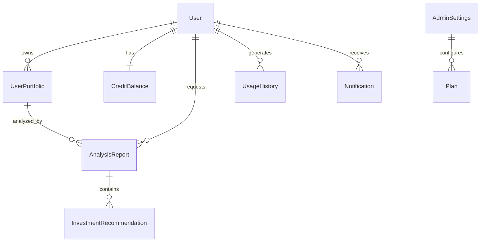

# 🗄️ Modelo de Dados FiiAI

## 📋 Visão Geral

O modelo de dados do FiiAI é construído com Prisma ORM e PostgreSQL, seguindo princípios de normalização e performance. O schema é otimizado para consultas de análise de portfólios FII e gestão de créditos.

## 🏗️ Estrutura do Banco

### **Entidades Principais**



## 👤 Entidade User

### **Schema**
```prisma
model User {
  id        String   @id @default(cuid())
  clerkId   String   @unique
  email     String?  @unique
  name      String?
  isActive  Boolean  @default(true)
  createdAt DateTime @default(now())
  updatedAt DateTime @updatedAt

  // Relacionamentos
  creditBalance      CreditBalance?
  usageHistory       UsageHistory[]
  storageObjects     StorageObject[]
  subscriptionEvents SubscriptionEvent[]
  userPortfolios     UserPortfolio[]
  analysisReports    AnalysisReport[]
  notifications      Notification[]

  // Índices
  @@index([email])
  @@index([name])
  @@index([createdAt])
  @@index([isActive])
}
```

### **Campos**
- **id**: Identificador único interno (CUID)
- **clerkId**: ID do usuário no Clerk (integração auth)
- **email**: Email do usuário (único, opcional)
- **name**: Nome completo do usuário
- **isActive**: Status ativo/inativo
- **createdAt/updatedAt**: Timestamps de auditoria

### **Índices Otimizados**
- `clerkId` (único) - Busca rápida por auth
- `email` - Busca por email
- `createdAt` - Ordenação temporal
- `isActive` - Filtro de usuários ativos

## 💰 Sistema de Créditos

### **CreditBalance**
```prisma
model CreditBalance {
  id               String   @id @default(cuid())
  userId           String   @unique
  clerkUserId      String   @unique
  creditsRemaining Int      @default(100)
  lastSyncedAt     DateTime @default(now())
  createdAt        DateTime @default(now())
  updatedAt        DateTime @updatedAt

  user             User     @relation(fields: [userId], references: [id])
  usageHistory     UsageHistory[]

  @@index([userId])
  @@index([clerkUserId])
  @@index([creditsRemaining])
  @@index([lastSyncedAt])
}
```

### **UsageHistory**
```prisma
model UsageHistory {
  id              String        @id @default(cuid())
  userId          String
  creditBalanceId String
  operationType   OperationType
  creditsUsed     Int
  details         Json?
  timestamp       DateTime      @default(now())

  user            User          @relation(fields: [userId], references: [id])
  creditBalance   CreditBalance @relation(fields: [creditBalanceId], references: [id])

  @@index([userId])
  @@index([timestamp])
  @@index([operationType])
  @@index([userId, timestamp])
  @@index([operationType, timestamp])
}
```

### **Tipos de Operação**
```prisma
enum OperationType {
  AI_TEXT_CHAT                    // 1 crédito
  AI_IMAGE_GENERATION             // 5 créditos
  FII_PORTFOLIO_ANALYSIS          // 10 créditos
  FII_INVESTMENT_RECOMMENDATION   // 15 créditos
}
```

## 📈 Domínio FII (Fundos Imobiliários)

### **UserPortfolio**
```prisma
model UserPortfolio {
  id               String    @id @default(cuid())
  userId           String
  originalFileName String
  uploadedAt       DateTime  @default(now())
  positions        Json      // Array de posições FII
  totalValue       Float
  lastAnalyzedAt   DateTime?

  user             User      @relation(fields: [userId], references: [id])
  analysisReports  AnalysisReport[]

  @@index([userId])
  @@index([uploadedAt])
  @@index([totalValue])
}
```

### **Estrutura de Positions (JSON)**
```typescript
interface FiiPosition {
  fiiCode: string;        // "HGLG11"
  fiiName: string;        // "HG Logística"
  sector: FiiSector;      // "LOGISTICO"
  quantity: number;       // 100
  avgPrice: number;       // 120.50
  currentValue: number;   // 12050.00
  percentage: number;     // 25.0
  dividendYield?: number; // 8.5
  lastPrice?: number;     // 120.50
}
```

### **AnalysisReport**
```prisma
model AnalysisReport {
  id                String       @id @default(cuid())
  userId            String
  userPortfolioId   String?
  analysisType      AnalysisType
  aiAgentVersion    String       @default("v1.0")

  // Dados da análise (JSON)
  summary           String       @db.Text
  currentAllocation Json
  riskAssessment    Json
  performanceMetrics Json
  recommendations   Json

  // Metadados
  processingTime    Int?
  creditsUsed       Int          @default(10)
  generatedAt       DateTime     @default(now())

  user              User         @relation(fields: [userId], references: [id])
  userPortfolio     UserPortfolio? @relation(fields: [userPortfolioId], references: [id])
  investmentRecommendations InvestmentRecommendation[]

  @@index([userId])
  @@index([analysisType])
  @@index([generatedAt])
  @@index([userPortfolioId])
}
```

### **Estruturas JSON de Análise**

**currentAllocation:**
```typescript
interface CurrentAllocation {
  [sector: string]: number; // Percentual por setor
  // Exemplo:
  // "LOGISTICO": 45.0,
  // "SHOPPING": 25.0,
  // "CORPORATIVO": 20.0,
  // "RESIDENCIAL": 10.0
}
```

**riskAssessment:**
```typescript
interface RiskAssessment {
  riskLevel: 'conservative' | 'moderate' | 'aggressive';
  volatility: number;        // 0.15 (15%)
  maxDrawdown: number;       // 0.12 (12%)
  sharpeRatio: number;       // 1.2
  concentrationRisk: number; // 0.45 (45% em um setor)
  liquidityRisk: 'low' | 'medium' | 'high';
}
```

**performanceMetrics:**
```typescript
interface PerformanceMetrics {
  totalReturn: number;           // 0.18 (18%)
  annualizedReturn: number;      // 0.12 (12%)
  dividendYield: number;         // 0.087 (8.7%)
  benchmarkComparison: number;   // 0.03 (3% acima do benchmark)
  consistency: number;           // 0.8 (80% de consistência)
  volatility: number;            // 0.15 (15%)
}
```

### **InvestmentRecommendation**
```prisma
model InvestmentRecommendation {
  id               String             @id @default(cuid())
  analysisReportId String
  fiiCode          String
  fiiName          String
  recommendation   RecommendationType
  targetPercentage Float?
  investmentAmount Float?
  reasoning        String             @db.Text
  confidence       Float              // 0-1
  priority         Int                @default(1) // 1-5

  analysisReport   AnalysisReport     @relation(fields: [analysisReportId], references: [id])

  @@index([analysisReportId])
  @@index([fiiCode])
  @@index([recommendation])
  @@index([priority])
}
```

### **Enums do Domínio FII**
```prisma
enum AnalysisType {
  PORTFOLIO_EVALUATION
  INVESTMENT_RECOMMENDATION
}

enum FiiSector {
  LOGISTICO      // Galpões logísticos
  SHOPPING       // Shopping centers
  CORPORATIVO    // Edifícios corporativos
  RESIDENCIAL    // Imóveis residenciais
  TIJOLO         // Imóveis físicos
  PAPEL          // Recebíveis imobiliários
  FUNDOS         // Fundos de fundos
  HIBRIDO        // Múltiplos setores
  OUTROS         // Outros tipos
}

enum RecommendationType {
  STRONG_BUY     // Compra forte
  BUY            // Compra
  HOLD           // Manter
  SELL           // Venda
  STRONG_SELL    // Venda forte
}
```

## 🔔 Sistema de Notificações

### **Notification**
```prisma
model Notification {
  id          String              @id @default(cuid())
  userId      String
  type        NotificationType
  priority    NotificationPriority @default(NORMAL)
  title       String
  message     String              @db.Text
  data        Json?
  read        Boolean             @default(false)
  readAt      DateTime?
  createdAt   DateTime            @default(now())
  expiresAt   DateTime?

  user        User                @relation(fields: [userId], references: [id])

  @@index([userId])
  @@index([type])
  @@index([priority])
  @@index([read])
  @@index([createdAt])
  @@index([expiresAt])
  @@index([userId, read])
  @@index([userId, createdAt])
}
```

### **Tipos de Notificação**
```prisma
enum NotificationType {
  ANALYSIS_COMPLETE      // Análise concluída
  CREDIT_LOW            // Créditos baixos
  CREDIT_DEPLETED       // Créditos esgotados
  MARKET_ALERT          // Alerta de mercado
  SYSTEM_UPDATE         // Atualização do sistema
  PORTFOLIO_ALERT       // Alerta de portfólio
  RECOMMENDATION_READY  // Recomendação pronta
}

enum NotificationPriority {
  LOW
  NORMAL
  HIGH
  URGENT
}
```

## ⚙️ Configurações Administrativas

### **AdminSettings (Singleton)**
```prisma
model AdminSettings {
  id           String   @id @default("singleton")
  featureCosts Json?
  createdAt    DateTime @default(now())
  updatedAt    DateTime @updatedAt
}
```

### **Estrutura featureCosts**
```typescript
interface FeatureCosts {
  AI_TEXT_CHAT: number;                    // 1
  AI_IMAGE_GENERATION: number;             // 5
  FII_PORTFOLIO_ANALYSIS: number;          // 10
  FII_INVESTMENT_RECOMMENDATION: number;   // 15
}
```

### **Plan (Billing Plans)**
```prisma
model Plan {
  id        String   @id @default(cuid())
  clerkId   String?  @unique // Clerk plan ID
  clerkName String?
  name      String
  credits   Int
  active    Boolean  @default(true)
  sortOrder Int      @default(0)

  // Pricing (cents)
  currency           String?
  priceMonthlyCents  Int?
  priceYearlyCents   Int?

  // Metadata
  description        String?  @db.Text
  features           Json?
  badge              String?
  highlight          Boolean  @default(false)
  ctaType            String?  @default("checkout")
  ctaLabel           String?
  ctaUrl             String?
  billingSource      String   @default("clerk")

  createdAt DateTime @default(now())
  updatedAt DateTime @updatedAt

  @@index([active])
  @@index([sortOrder])
}
```

## 💾 Storage e Uploads

### **StorageObject**
```prisma
model StorageObject {
  id           String    @id @default(cuid())
  userId       String
  clerkUserId  String
  provider     String    @default("vercel_blob")
  url          String
  pathname     String
  name         String
  contentType  String?
  size         Int
  deletedAt    DateTime?
  createdAt    DateTime  @default(now())
  updatedAt    DateTime  @updatedAt

  user         User      @relation(fields: [userId], references: [id])

  @@index([userId])
  @@index([createdAt])
  @@index([clerkUserId])
  @@index([contentType])
  @@index([deletedAt])
  @@index([name])
}
```

## 📊 Analytics e Eventos

### **SubscriptionEvent**
```prisma
model SubscriptionEvent {
  id           String   @id @default(cuid())
  userId       String?
  clerkUserId  String
  planKey      String?
  status       String
  eventType    String
  occurredAt   DateTime @default(now())
  metadata     Json?
  createdAt    DateTime @default(now())

  user         User?    @relation(fields: [userId], references: [id])

  @@index([clerkUserId, occurredAt])
  @@index([userId, occurredAt])
}
```

## 📈 Estratégia de Indexação

### **Índices Principais**

**Performance Queries:**
```sql
-- Busca de portfólios por usuário (mais comum)
CREATE INDEX idx_portfolios_user_created ON user_portfolios(user_id, uploaded_at DESC);

-- Busca de análises por usuário e data
CREATE INDEX idx_analysis_user_date ON analysis_reports(user_id, generated_at DESC);

-- Histórico de uso por tipo e data
CREATE INDEX idx_usage_type_date ON usage_history(operation_type, timestamp DESC);
```

**Admin Queries:**
```sql
-- Analytics por período
CREATE INDEX idx_users_created_active ON users(created_at, is_active);
CREATE INDEX idx_subscription_events_date ON subscription_events(occurred_at DESC);

-- Busca de créditos baixos
CREATE INDEX idx_credits_remaining ON credit_balance(credits_remaining) WHERE credits_remaining < 50;
```

### **Consultas Otimizadas**

**Dashboard do Usuário:**
```sql
-- Portfólios recentes com última análise
SELECT
  up.*,
  ar.generated_at as last_analysis
FROM user_portfolios up
LEFT JOIN LATERAL (
  SELECT generated_at
  FROM analysis_reports ar
  WHERE ar.user_portfolio_id = up.id
  ORDER BY generated_at DESC
  LIMIT 1
) ar ON true
WHERE up.user_id = $1
ORDER BY up.uploaded_at DESC;
```

**Analytics Admin:**
```sql
-- Estatísticas mensais
SELECT
  DATE_TRUNC('month', created_at) as month,
  COUNT(*) as new_users,
  SUM(CASE WHEN is_active THEN 1 ELSE 0 END) as active_users
FROM users
WHERE created_at >= NOW() - INTERVAL '12 months'
GROUP BY month
ORDER BY month;
```

## 🔄 Migrations e Versionamento

### **Estrutura de Migration**
```sql
-- 001_initial_schema.sql
CREATE TABLE users (
  id TEXT PRIMARY KEY,
  clerk_id TEXT UNIQUE NOT NULL,
  email TEXT UNIQUE,
  name TEXT,
  is_active BOOLEAN DEFAULT true,
  created_at TIMESTAMP DEFAULT NOW(),
  updated_at TIMESTAMP DEFAULT NOW()
);

-- Triggers para updated_at
CREATE OR REPLACE FUNCTION update_updated_at_column()
RETURNS TRIGGER AS $$
BEGIN
  NEW.updated_at = NOW();
  RETURN NEW;
END;
$$ language 'plpgsql';

CREATE TRIGGER update_users_updated_at
  BEFORE UPDATE ON users
  FOR EACH ROW EXECUTE FUNCTION update_updated_at_column();
```

### **Seed Data**
```typescript
// prisma/seed.ts
import { PrismaClient } from '@prisma/client';

const prisma = new PrismaClient();

async function main() {
  // Admin settings singleton
  await prisma.adminSettings.upsert({
    where: { id: 'singleton' },
    update: {},
    create: {
      id: 'singleton',
      featureCosts: {
        AI_TEXT_CHAT: 1,
        AI_IMAGE_GENERATION: 5,
        FII_PORTFOLIO_ANALYSIS: 10,
        FII_INVESTMENT_RECOMMENDATION: 15,
      },
    },
  });

  // Planos padrão
  await prisma.plan.createMany({
    data: [
      {
        name: 'Básico',
        credits: 100,
        priceMonthlyCents: 2900,
        description: 'Ideal para iniciantes',
        sortOrder: 1,
      },
      {
        name: 'Pro',
        credits: 500,
        priceMonthlyCents: 9900,
        description: 'Para investidores ativos',
        highlight: true,
        sortOrder: 2,
      },
    ],
  });
}

main().catch(console.error).finally(() => prisma.$disconnect());
```

## 🚀 Performance e Monitoramento

### **Connection Pooling**
```typescript
// lib/db.ts
import { PrismaClient } from '@prisma/client';

const globalForPrisma = globalThis as unknown as {
  prisma: PrismaClient | undefined;
};

export const db = globalForPrisma.prisma ?? new PrismaClient({
  log: ['query', 'error', 'warn'],
  datasources: {
    db: {
      url: process.env.DATABASE_URL,
    },
  },
});

if (process.env.NODE_ENV !== 'production') globalForPrisma.prisma = db;
```

### **Query Monitoring**
```typescript
// Middleware para logging de queries lentas
db.$use(async (params, next) => {
  const before = Date.now();
  const result = await next(params);
  const after = Date.now();

  const queryTime = after - before;

  if (queryTime > 1000) { // Log queries > 1s
    console.warn(`Slow query detected: ${params.model}.${params.action} took ${queryTime}ms`);
  }

  return result;
});
```

---
**Próximos Passos:** Consulte [Sistema de Créditos](./sistema-creditos.md) para detalhes da implementação de cobrança.