# 💰 Sistema de Créditos FiiAI

## 📋 Visão Geral

O sistema de créditos é o núcleo de monetização da plataforma FiiAI. Ele controla o acesso às funcionalidades por meio de um sistema baseado em consumo, integrado ao Clerk para gestão de assinaturas e billing.

## 🏗️ Arquitetura do Sistema

### **Fluxo de Créditos**

```mermaid
sequenceDiagram
    participant U as Usuário
    participant App as Aplicação
    participant DB as Database
    participant Clerk as Clerk
    participant AI as IA Service

    U->>App: Solicita operação custosa
    App->>DB: Verificar saldo de créditos
    DB->>App: Saldo atual
    App->>App: Calcular custo da operação

    alt Saldo suficiente
        App->>AI: Executar operação
        AI->>App: Resultado
        App->>Clerk: Debitar créditos
        Clerk->>App: Confirmação
        App->>DB: Registrar uso
        App->>U: Retornar resultado
    else Saldo insuficiente
        App->>U: Erro - créditos insuficientes
    end
```


## 💳 Modelo de Preços

### **Custos por Operação**
```typescript
const OPERATION_COSTS = {
  AI_TEXT_CHAT: 1,                    // Chat simples com IA
  AI_IMAGE_GENERATION: 5,             // Geração de imagens
  FII_PORTFOLIO_ANALYSIS: 10,         // Análise completa de portfólio
  FII_INVESTMENT_RECOMMENDATION: 15,  // Recomendações personalizadas
} as const;
```

### **Planos de Assinatura**
```typescript
interface Plan {
  id: string;
  name: string;
  credits: number;
  priceMonthlyCents: number;
  priceYearlyCents: number;
  features: string[];
  highlight?: boolean;
}

const PLANS = [
  {
    name: 'Básico',
    credits: 100,
    priceMonthlyCents: 2900,      // R$ 29,00
    priceYearlyCents: 29000,      // R$ 290,00 (2 meses grátis)
    features: [
      '100 créditos mensais',
      '10 análises de portfólio',
      'Suporte por email',
    ],
  },
  {
    name: 'Pro',
    credits: 500,
    priceMonthlyCents: 9900,      // R$ 99,00
    priceYearlyCents: 99000,      // R$ 990,00 (2 meses grátis)
    features: [
      '500 créditos mensais',
      '50 análises de portfólio',
      'Recomendações ilimitadas',
      'Suporte prioritário',
    ],
    highlight: true,
  },
  {
    name: 'Enterprise',
    credits: 2000,
    priceMonthlyCents: 29900,     // R$ 299,00
    priceYearlyCents: 299000,     // R$ 2990,00 (2 meses grátis)
    features: [
      '2000 créditos mensais',
      'Análises ilimitadas',
      'API dedicada',
      'Suporte 24/7',
      'Onboarding personalizado',
    ],
  },
];
```

## 🗄️ Estrutura de Dados

### **CreditBalance**
```prisma
model CreditBalance {
  id               String   @id @default(cuid())
  userId           String   @unique
  clerkUserId      String   @unique
  creditsRemaining Int      @default(100)  // Cache do Clerk
  lastSyncedAt     DateTime @default(now())
  createdAt        DateTime @default(now())
  updatedAt        DateTime @updatedAt

  user             User     @relation(fields: [userId], references: [id])
  usageHistory     UsageHistory[]
}
```

### **UsageHistory**
```prisma
model UsageHistory {
  id              String        @id @default(cuid())
  userId          String
  creditBalanceId String
  operationType   OperationType
  creditsUsed     Int
  details         Json?         // Metadados da operação
  timestamp       DateTime      @default(now())

  user            User          @relation(fields: [userId], references: [id])
  creditBalance   CreditBalance @relation(fields: [creditBalanceId], references: [id])
}
```

### **AdminSettings**
```prisma
model AdminSettings {
  id           String @id @default("singleton")
  featureCosts Json? // Configuração dinâmica de custos
  createdAt    DateTime @default(now())
  updatedAt    DateTime @updatedAt
}
```

## 🔧 Implementação

### **1. Service de Gestão de Créditos**
```typescript
// lib/services/credit-service.ts
import { db } from '@/lib/db';
import { clerkClient } from '@clerk/nextjs/server';

export class CreditService {
  /**
   * Verificar saldo de créditos do usuário
   */
  async getBalance(userId: string): Promise<CreditBalance> {
    const balance = await db.creditBalance.findUnique({
      where: { userId },
    });

    if (!balance) {
      throw new Error('Credit balance not found');
    }

    // Sincronizar com Clerk se necessário
    if (this.shouldSync(balance.lastSyncedAt)) {
      return this.syncWithClerk(balance);
    }

    return balance;
  }

  /**
   * Consumir créditos para uma operação
   */
  async consumeCredits(
    userId: string,
    operationType: OperationType,
    customCost?: number
  ): Promise<{ success: boolean; remainingCredits: number }> {
    const cost = customCost ?? await this.getOperationCost(operationType);

    return db.$transaction(async (tx) => {
      // 1. Verificar saldo atual
      const balance = await tx.creditBalance.findUnique({
        where: { userId },
        select: { id: true, creditsRemaining: true, clerkUserId: true },
      });

      if (!balance || balance.creditsRemaining < cost) {
        throw new CreditInsufficientError('Créditos insuficientes');
      }

      // 2. Debitar do Clerk
      await this.debitFromClerk(balance.clerkUserId, cost);

      // 3. Atualizar saldo local
      const updatedBalance = await tx.creditBalance.update({
        where: { id: balance.id },
        data: {
          creditsRemaining: balance.creditsRemaining - cost,
          lastSyncedAt: new Date(),
        },
      });

      // 4. Registrar histórico
      await tx.usageHistory.create({
        data: {
          userId,
          creditBalanceId: balance.id,
          operationType,
          creditsUsed: cost,
          details: {
            timestamp: new Date(),
            method: 'automatic_debit',
          },
        },
      });

      return {
        success: true,
        remainingCredits: updatedBalance.creditsRemaining,
      };
    });
  }

  /**
   * Obter custo de uma operação
   */
  private async getOperationCost(operationType: OperationType): Promise<number> {
    const settings = await db.adminSettings.findUnique({
      where: { id: 'singleton' },
    });

    const costs = settings?.featureCosts as Record<string, number> || DEFAULT_COSTS;
    return costs[operationType] || 1;
  }

  /**
   * Sincronizar saldo com Clerk
   */
  private async syncWithClerk(balance: CreditBalance): Promise<CreditBalance> {
    try {
      const user = await clerkClient.users.getUser(balance.clerkUserId);
      const clerkCredits = user.publicMetadata.credits as number || 0;

      return db.creditBalance.update({
        where: { id: balance.id },
        data: {
          creditsRemaining: clerkCredits,
          lastSyncedAt: new Date(),
        },
      });
    } catch (error) {
      console.error('Failed to sync with Clerk:', error);
      return balance; // Retornar saldo cache em caso de erro
    }
  }

  /**
   * Debitar créditos no Clerk
   */
  private async debitFromClerk(clerkUserId: string, amount: number): Promise<void> {
    const user = await clerkClient.users.getUser(clerkUserId);
    const currentCredits = user.publicMetadata.credits as number || 0;
    const newCredits = Math.max(0, currentCredits - amount);

    await clerkClient.users.updateUser(clerkUserId, {
      publicMetadata: {
        ...user.publicMetadata,
        credits: newCredits,
      },
    });
  }

  /**
   * Verificar se deve sincronizar com Clerk
   */
  private shouldSync(lastSyncedAt: Date): boolean {
    const fiveMinutesAgo = new Date(Date.now() - 5 * 60 * 1000);
    return lastSyncedAt < fiveMinutesAgo;
  }
}
```

### **2. Hook para Consumo de Créditos**
```typescript
// hooks/use-credits.ts
import { useMutation, useQuery, useQueryClient } from '@tanstack/react-query';
import { api } from '@/lib/api-client';

interface CreditBalance {
  creditsRemaining: number;
  lastSyncedAt: string;
}

interface ConsumeCreditsData {
  operationType: OperationType;
  creditsToConsume?: number;
  details?: Record<string, any>;
}

export function useCreditBalance() {
  return useQuery<CreditBalance>({
    queryKey: ['credits', 'balance'],
    queryFn: () => api.get('/api/credits/balance'),
    staleTime: 2 * 60_000, // 2 minutos
    refetchInterval: 5 * 60_000, // Refetch a cada 5 minutos
  });
}

export function useConsumeCredits() {
  const queryClient = useQueryClient();

  return useMutation({
    mutationFn: (data: ConsumeCreditsData) =>
      api.post('/api/credits/consume', data),

    onSuccess: (result) => {
      // Atualizar cache do saldo
      queryClient.setQueryData(['credits', 'balance'], (old: CreditBalance) => ({
        ...old,
        creditsRemaining: result.creditsRemaining,
        lastSyncedAt: new Date().toISOString(),
      }));

      // Invalidar histórico
      queryClient.invalidateQueries({ queryKey: ['credits', 'history'] });
    },

    onError: (error) => {
      console.error('Erro ao consumir créditos:', error);

      // Mostrar notificação de erro
      if (error.message.includes('insuficientes')) {
        // Redirecionar para página de billing
        window.location.href = '/billing';
      }
    },
  });
}

export function useCreditHistory() {
  return useQuery({
    queryKey: ['credits', 'history'],
    queryFn: () => api.get('/api/credits/history'),
    staleTime: 1 * 60_000, // 1 minuto
  });
}
```

### **3. Componente de Verificação de Créditos**
```typescript
// components/credit-guard.tsx
import { useCreditBalance, useConsumeCredits } from '@/hooks/use-credits';
import { Button } from '@/components/ui/button';
import { AlertTriangle, CreditCard } from 'lucide-react';

interface CreditGuardProps {
  operationType: OperationType;
  cost?: number;
  children: React.ReactNode;
  onSuccess?: () => void;
}

export function CreditGuard({
  operationType,
  cost,
  children,
  onSuccess,
}: CreditGuardProps) {
  const { data: balance, isLoading } = useCreditBalance();
  const consumeCredits = useConsumeCredits();

  const operationCost = cost ?? getDefaultCost(operationType);
  const hasEnoughCredits = balance && balance.creditsRemaining >= operationCost;

  const handleExecute = async () => {
    try {
      await consumeCredits.mutateAsync({
        operationType,
        creditsToConsume: operationCost,
      });
      onSuccess?.();
    } catch (error) {
      // Erro já tratado no hook
    }
  };

  if (isLoading) {
    return <div>Verificando créditos...</div>;
  }

  if (!hasEnoughCredits) {
    return (
      <div className="border border-orange-200 rounded-lg p-4 bg-orange-50">
        <div className="flex items-center gap-2 text-orange-800 mb-3">
          <AlertTriangle className="h-5 w-5" />
          <span className="font-medium">Créditos Insuficientes</span>
        </div>

        <p className="text-sm text-orange-700 mb-4">
          Esta operação custa {operationCost} créditos, mas você possui apenas{' '}
          {balance?.creditsRemaining || 0} créditos disponíveis.
        </p>

        <Button asChild variant="outline" size="sm">
          <a href="/billing" className="flex items-center gap-2">
            <CreditCard className="h-4 w-4" />
            Comprar Créditos
          </a>
        </Button>
      </div>
    );
  }

  return (
    <div className="space-y-4">
      <div className="flex items-center justify-between text-sm text-muted-foreground">
        <span>Custo da operação: {operationCost} créditos</span>
        <span>Saldo: {balance.creditsRemaining} créditos</span>
      </div>

      <Button
        onClick={handleExecute}
        disabled={consumeCredits.isPending}
        className="w-full"
      >
        {consumeCredits.isPending ? 'Processando...' : children}
      </Button>
    </div>
  );
}
```

## 🚀 APIs do Sistema

### **GET /api/credits/balance**
Retorna saldo atual de créditos.

```typescript
// app/api/credits/balance/route.ts
export async function GET() {
  const { userId } = await auth();
  if (!userId) return new Response('Unauthorized', { status: 401 });

  const user = await getUserFromClerkId(userId);
  const creditService = new CreditService();

  const balance = await creditService.getBalance(user.id);

  return Response.json({
    creditsRemaining: balance.creditsRemaining,
    lastSyncedAt: balance.lastSyncedAt,
  });
}
```

### **POST /api/credits/consume**
Consome créditos para uma operação.

```typescript
// app/api/credits/consume/route.ts
const ConsumeSchema = z.object({
  operationType: z.nativeEnum(OperationType),
  creditsToConsume: z.number().optional(),
  details: z.record(z.any()).optional(),
});

export async function POST(request: Request) {
  const { userId } = await auth();
  if (!userId) return new Response('Unauthorized', { status: 401 });

  const body = await request.json();
  const { operationType, creditsToConsume, details } = ConsumeSchema.parse(body);

  const user = await getUserFromClerkId(userId);
  const creditService = new CreditService();

  try {
    const result = await creditService.consumeCredits(
      user.id,
      operationType,
      creditsToConsume
    );

    return Response.json({
      success: true,
      creditsRemaining: result.remainingCredits,
    });
  } catch (error) {
    if (error instanceof CreditInsufficientError) {
      return Response.json(
        { error: error.message },
        { status: 402 } // Payment Required
      );
    }

    throw error;
  }
}
```

### **GET /api/credits/history**
Histórico de uso de créditos.

```typescript
// app/api/credits/history/route.ts
export async function GET(request: Request) {
  const { userId } = await auth();
  if (!userId) return new Response('Unauthorized', { status: 401 });

  const url = new URL(request.url);
  const page = parseInt(url.searchParams.get('page') || '1');
  const limit = Math.min(parseInt(url.searchParams.get('limit') || '20'), 100);

  const user = await getUserFromClerkId(userId);

  const [history, total] = await Promise.all([
    db.usageHistory.findMany({
      where: { userId: user.id },
      orderBy: { timestamp: 'desc' },
      skip: (page - 1) * limit,
      take: limit,
    }),
    db.usageHistory.count({
      where: { userId: user.id },
    }),
  ]);

  return Response.json({
    data: history,
    pagination: {
      page,
      limit,
      total,
      totalPages: Math.ceil(total / limit),
    },
  });
}
```

## 🔄 Sincronização com Clerk

### **Webhook Handler**
```typescript
// app/api/webhooks/clerk/route.ts
import { Webhook } from 'svix';

export async function POST(request: Request) {
  const payload = await request.text();
  const headers = Object.fromEntries(request.headers.entries());

  const webhook = new Webhook(process.env.CLERK_WEBHOOK_SECRET!);

  try {
    const event = webhook.verify(payload, headers);

    switch (event.type) {
      case 'user.created':
        await handleUserCreated(event.data);
        break;

      case 'user.updated':
        await handleUserUpdated(event.data);
        break;

      case 'subscription.created':
      case 'subscription.updated':
        await handleSubscriptionChange(event.data);
        break;
    }

    return Response.json({ received: true });
  } catch (error) {
    console.error('Webhook error:', error);
    return new Response('Invalid signature', { status: 400 });
  }
}

async function handleUserCreated(userData: any) {
  // Criar usuário no banco
  const user = await db.user.create({
    data: {
      clerkId: userData.id,
      email: userData.email_addresses[0]?.email_address,
      name: `${userData.first_name} ${userData.last_name}`.trim(),
    },
  });

  // Criar saldo de créditos inicial
  await db.creditBalance.create({
    data: {
      userId: user.id,
      clerkUserId: userData.id,
      creditsRemaining: 100, // Créditos iniciais gratuitos
    },
  });
}

async function handleSubscriptionChange(subscriptionData: any) {
  const clerkUserId = subscriptionData.user_id;
  const planCredits = getPlanCredits(subscriptionData.plan_id);

  // Atualizar créditos no Clerk
  await clerkClient.users.updateUser(clerkUserId, {
    publicMetadata: {
      credits: planCredits,
      plan: subscriptionData.plan_id,
    },
  });

  // Sincronizar com banco local
  await db.creditBalance.update({
    where: { clerkUserId },
    data: {
      creditsRemaining: planCredits,
      lastSyncedAt: new Date(),
    },
  });
}
```

## 📊 Analytics e Monitoramento

### **Dashboard de Créditos**
```typescript
// components/credit-dashboard.tsx
export function CreditDashboard() {
  const { data: balance } = useCreditBalance();
  const { data: history } = useCreditHistory();

  const usageThisMonth = useMemo(() => {
    const thisMonth = new Date().getMonth();
    return history?.data.filter(usage =>
      new Date(usage.timestamp).getMonth() === thisMonth
    ).reduce((sum, usage) => sum + usage.creditsUsed, 0) || 0;
  }, [history]);

  return (
    <div className="grid grid-cols-1 md:grid-cols-3 gap-6">
      <Card>
        <CardHeader>
          <CardTitle>Saldo Atual</CardTitle>
        </CardHeader>
        <CardContent>
          <div className="text-3xl font-bold">
            {balance?.creditsRemaining || 0}
          </div>
          <p className="text-muted-foreground">créditos disponíveis</p>
        </CardContent>
      </Card>

      <Card>
        <CardHeader>
          <CardTitle>Uso Mensal</CardTitle>
        </CardHeader>
        <CardContent>
          <div className="text-3xl font-bold">{usageThisMonth}</div>
          <p className="text-muted-foreground">créditos consumidos</p>
        </CardContent>
      </Card>

      <Card>
        <CardHeader>
          <CardTitle>Estimativa</CardTitle>
        </CardHeader>
        <CardContent>
          <div className="text-3xl font-bold">
            {Math.ceil((balance?.creditsRemaining || 0) / 10)}
          </div>
          <p className="text-muted-foreground">análises restantes</p>
        </CardContent>
      </Card>
    </div>
  );
}
```

### **Alertas de Créditos Baixos**
```typescript
// lib/notifications.ts
export async function checkLowCredits(userId: string) {
  const balance = await db.creditBalance.findUnique({
    where: { userId },
  });

  if (!balance) return;

  const { creditsRemaining } = balance;

  // Alerta quando restam menos de 20 créditos
  if (creditsRemaining <= 20 && creditsRemaining > 5) {
    await createNotification({
      userId,
      type: 'CREDIT_LOW',
      priority: 'NORMAL',
      title: 'Créditos baixos',
      message: `Você tem apenas ${creditsRemaining} créditos restantes. Considere recarregar sua conta.`,
    });
  }

  // Alerta crítico quando restam menos de 5 créditos
  if (creditsRemaining <= 5) {
    await createNotification({
      userId,
      type: 'CREDIT_DEPLETED',
      priority: 'HIGH',
      title: 'Créditos quase esgotados',
      message: `Você tem apenas ${creditsRemaining} créditos restantes. Recarregue agora para continuar usando.`,
    });
  }
}
```

## 🔧 Configuração Administrativa

### **Painel de Configuração de Custos**
```typescript
// app/admin/settings/credits/page.tsx
export default function CreditSettingsPage() {
  const [costs, setCosts] = useState<Record<string, number>>({});

  const updateCosts = async (newCosts: Record<string, number>) => {
    await api.put('/api/admin/settings', {
      featureCosts: newCosts,
    });
    setCosts(newCosts);
  };

  return (
    <div className="space-y-6">
      <h1 className="text-2xl font-bold">Configuração de Custos</h1>

      {Object.entries(OPERATION_TYPES).map(([key, label]) => (
        <div key={key} className="flex items-center justify-between">
          <label>{label}</label>
          <Input
            type="number"
            value={costs[key] || 0}
            onChange={(e) => setCosts(prev => ({
              ...prev,
              [key]: parseInt(e.target.value),
            }))}
            className="w-24"
          />
        </div>
      ))}

      <Button onClick={() => updateCosts(costs)}>
        Salvar Configurações
      </Button>
    </div>
  );
}
```

---
**Próximos Passos:** Consulte [Regras de Negócio FII](./regras-negocio-fii.md) para entender o domínio específico.